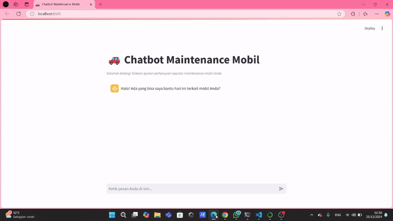

# Chatbot Servis Mobil

Selamat datang di **Chatbot Servis Mobil**! 🚗💬

Chatbot ini dirancang untuk membantu pengguna dalam mendapatkan informasi dan layanan terkait servis mobil. Dengan teknologi Natural Language Processing (NLP) menggunakan **NLTK**, pembelajaran mesin melalui **TensorFlow**, dan antarmuka interaktif berbasis **Streamlit**, chatbot ini memberikan pengalaman yang cepat dan responsif.

---

## 🎯 **Fitur Utama**

1. **Informasi Servis**: Memberikan informasi tentang jenis servis mobil, jadwal servis berkala, dan rekomendasi perawatan.
2. **Reservasi Servis**: Membantu pengguna untuk melakukan reservasi servis langsung melalui chatbot.
3. **Tanya Jawab Umum**: Menjawab pertanyaan umum terkait servis mobil, seperti biaya, waktu pengerjaan, dan lokasi bengkel terdekat.
4. **Personalisasi Pengalaman**: Menggunakan analisis teks untuk memahami kebutuhan pengguna dan memberikan jawaban yang relevan.

---

## 🛠️ **Teknologi yang Digunakan**

- **NLTK (Natural Language Toolkit)**: Untuk preprocessing teks, seperti tokenisasi, stemming, dan analisis sintaksis.
- **TensorFlow**: Untuk membangun model pembelajaran mesin yang mampu memahami dan merespons pertanyaan pengguna.
- **Streamlit**: Untuk menciptakan antarmuka web yang interaktif dan mudah digunakan.

---

## 🚀 **Cara Menjalankan Aplikasi**

### **Persyaratan**
Pastikan Anda telah menginstal:
- Python 3.8 atau lebih baru
- pip (Python package manager)

### **Langkah Instalasi**

1. **Clone Repository**:
   ```bash
   git clone https://github.com/hafizhpratam/Chatbot_Servis-Mobil.git
   cd Chatbot-servis-mobil
   ```

2. **Instalasi Dependensi**:
   ```bash
   pip install -r requirements.txt
   ```

3. **Jalankan Aplikasi**:
   ```bash
   streamlit run app.py
   ```

4. **Akses Chatbot**:
   Buka browser Anda dan akses `http://localhost:8501` untuk mulai menggunakan chatbot.
---

## 📊 **Dataset**
Chatbot ini menggunakan dataset yang telah dirancang khusus untuk menangani percakapan terkait servis mobil, termasuk kategori seperti:
- Jadwal dan biaya servis
- Pertanyaan teknis terkait kendaraan

---

## 🌟 **Keunggulan Chatbot**
- **Interaktif dan Responsif**: Chatbot memberikan jawaban secara cepat dan akurat.
- **Mudah Digunakan**: Antarmuka berbasis Streamlit yang sederhana dan user-friendly.
- **Dapat Dikustomisasi**: Dataset dan model dapat disesuaikan dengan kebutuhan bisnis Anda.
---

## 🎥 **Demo**

Ingin melihat chatbot ini beraksi? Tonton demo interaktifnya berikut:


---

## 🧑‍💻 **Kontributor**
- Hafizh Ayyasy Pratama
- Kavka Muhammad
---

Selamat menggunakan Chatbot Servis Mobil! 🚘💡
